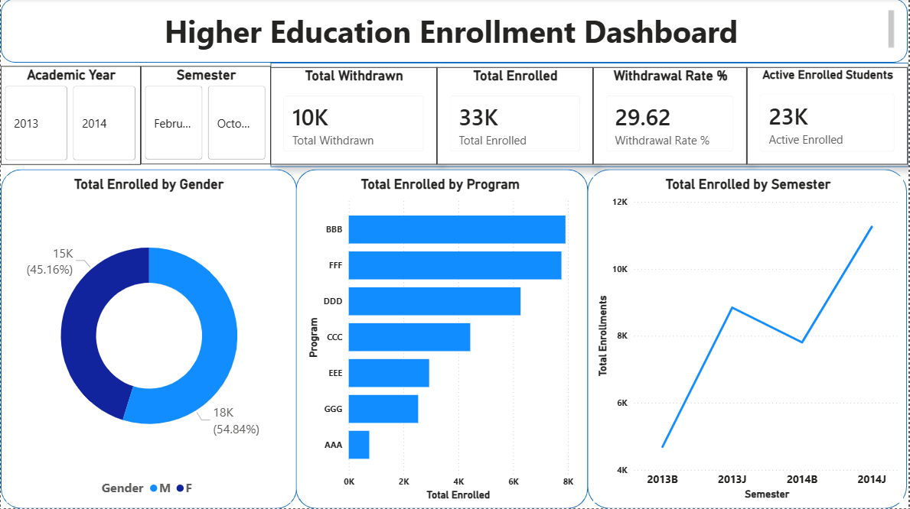
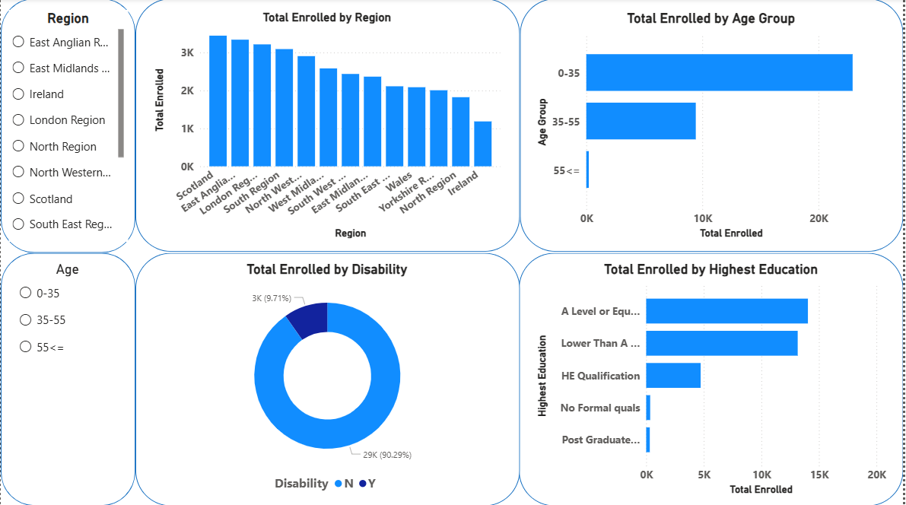
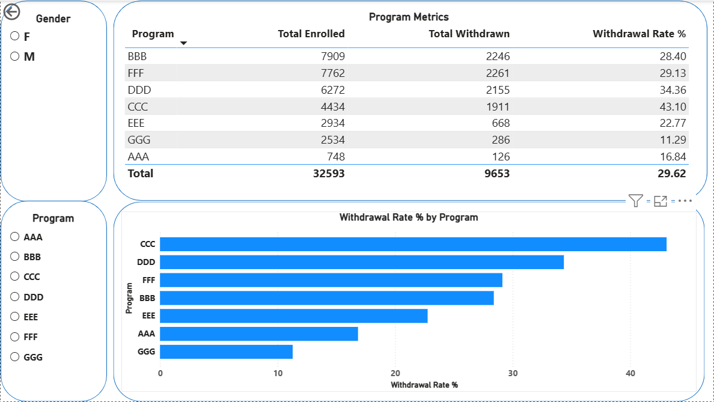

# 🎓 Higher Education Enrollment Dashboard

An interactive Power BI dashboard visualizing student enrollment trends, demographics, and program metrics using the Open University Learning Analytics Dataset (OULAD). Built to support academic planning decisions through data-driven insights.

---

## 📊 Dashboard Preview

### Overview Page


### Demographics Page


### Program Metrics Page


---

## 🎯 Problem Statement

The academic planning team needs visibility into enrollment trends, demographic patterns, and program performance to make informed decisions about resource allocation and student support.

> **Key questions this dashboard answers:**
> - How many students enrolled each semester and how has it changed year over year?
> - Which programs are growing or shrinking in enrollment?
> - Are certain demographics withdrawing at higher rates?
> - Which regions and age groups are most represented?
> - Which programs have the highest withdrawal rates?

---

## 📁 Dataset

**Source:** [Open University Learning Analytics Dataset (OULAD)](https://www.kaggle.com/datasets/rocki37/open-university-learning-analytics-dataset)

| Table | Description | Rows |
|---|---|---|
| `studentInfo.csv` | Student demographics and final results | 32,593 |
| `studentRegistration.csv` | Enrollment and withdrawal events | 32,593 |
| `courses.csv` | Course/program metadata | 22 |

> **Note:** Only these 3 tables are used. `studentVle.csv` and `studentAssessment.csv` are excluded as they are out of scope for enrollment analysis.

---

## 🛠️ Tools & Technologies

| Tool | Purpose |
|---|---|
| **SQL Server 2025** | Data storage and modeling |
| **SSMS** | SQL development and query execution |
| **Power BI Desktop** | Dashboard development and visualization |
| **DAX** | Measures and KPI calculations |
| **Git & GitHub** | Version control |

---

## 🗄️ SQL Data Model

Three raw tables are integrated into a single master view used by Power BI:

```
studentRegistration (fact)
    ├── JOIN studentInfo ON id_student + code_module + code_presentation
    └── JOIN courses ON code_module + code_presentation
                    ↓
        vw_enrollment_master (view)
                    ↓
            Power BI Dashboard
```

**View:** `dbo.vw_enrollment_master`
- Joins all 3 tables into one clean, flat result
- Derives `enrollment_status` (Active / Withdrawn)
- Extracts `academic_year` and `semester_name` from raw presentation codes
- Replaces NULL `imd_band` values with "Not Available"

SQL scripts are available in the [`/sql`](./sql) folder.

---

## 📐 DAX Measures

| Measure | Formula Logic |
|---|---|
| Total Enrolled | COUNT of all enrollment records |
| Total Withdrawn | COUNT where date_unregistration is not blank |
| Active Enrolled | Total Enrolled minus Total Withdrawn |
| Withdrawal Rate % | Total Withdrawn divided by Total Enrolled × 100 |

---

## 📋 Dashboard Pages

### 1. Overview
Executive summary with KPI cards, enrollment trend by semester, enrollment by program, and gender split.

### 2. Demographics
Breakdown of enrollment by region, age group, highest education level, and disability status.

### 3. Program Metrics
Program-level table showing Total Enrolled, Total Withdrawn, and Withdrawal Rate % per course. Configured as a drill-through target page from the Overview.

---

## 🚀 How to Run Locally

### Prerequisites
- SQL Server 2022+ (Developer Edition)
- SQL Server Management Studio (SSMS)
- Power BI Desktop

### Steps

1. **Clone the repository**
```bash
git clone https://github.com/Chandini149/higher-ed-enrollment-dashboard.git
```

2. **Download the dataset**
Download the 3 CSV files from [Kaggle OULAD](https://www.kaggle.com/datasets/rocki37/open-university-learning-analytics-dataset):
- `studentInfo.csv`
- `studentRegistration.csv`
- `courses.csv`

3. **Set up the database**
- Open SSMS and connect to your local SQL Server
- Create a database named `HigherEdEnrollment`
- Import the 3 CSV files using Tasks → Import Flat File
- Run the view script: `sql/01_create_view.sql`

4. **Open Power BI**
- Open `powerbi/enrollment_dashboard.pbix`
- Update the data source connection to point to your local SQL Server
- Refresh the data

---

## 📂 Repository Structure

```
higher-ed-enrollment-dashboard/
│
├── data/
│   ├── studentInfo.csv
│   ├── studentRegistration.csv
│   └── courses.csv
│
├── sql/
│   └── 01_create_view.sql
│
├── powerbi/
│   └── enrollment_dashboard.pbix
│
├── screenshots/
│   ├── overview.png
│   ├── demographics.png
│   └── program_metrics.png
│
└── README.md
```

---

## 🔍 Key Insights

- **32,593** students enrolled across 7 programs and 4 semester presentations (2013-2014)
- Overall withdrawal rate of **~29.6%** across all programs
- **BBB and FFF** are the highest enrolled programs
- **0-35 age group** represents the majority of enrollments
- **A Level or Equivalent** is the most common prior education level among enrolled students
